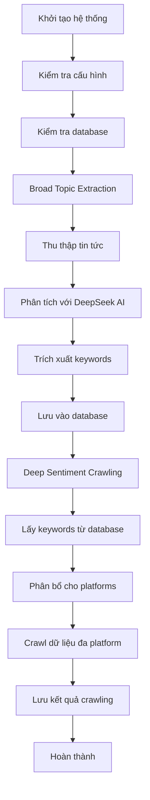

# MindSpider Tổng quan Kiến trúc

## 1. Giới thiệu

MindSpider là một hệ thống AI-powered web crawler thông minh, được thiết kế để thu thập và phân tích dữ liệu từ nhiều nền tảng mạng xã hội và trang web tin tức. Hệ thống bao gồm hai module chính: BroadTopicExtraction (trích xuất chủ đề rộng) và DeepSentimentCrawling (thu thập cảm xúc sâu), hoạt động theo quy trình pipeline để thu thập dữ liệu một cách thông minh và có chủ đích.

## 2. Mục đích Thiết kế

MindSpider được thiết kế để:

- **Tự động phát hiện chủ đề nóng**: Phân tích tin tức hàng ngày để xác định các chủ đề đang thịnh hành
- **Thu thập dữ liệu đa nền tảng**: Crawl dữ liệu từ 7 nền tảng mạng xã hội phổ biến (小红书, 抖音, 快手, B站, 微博, 贴吧, 知乎)
- **Phân tích cảm xúc và xu hướng**: Sử dụng AI để phân tích dữ liệu thu thập được
- **Quản lý dữ liệu có cấu trúc**: Lưu trữ và quản lý dữ liệu trong database với schema rõ ràng
- **Hỗ trợ quyết định kinh doanh**: Cung cấp insights cho các quyết định marketing và chiến lược

## 3. Kiến trúc Chi tiết

### 3.1. Các Thành phần Chính

#### 3.1.1. MindSpider Main ([`MindSpider/main.py`](MindSpider/main.py:34))

Lớp chính điều phối toàn bộ hệ thống:

```python
class MindSpider:
    def __init__(self):
        self.project_root = project_root
        self.broad_topic_path = self.project_root / "BroadTopicExtraction"
        self.deep_sentiment_path = self.project_root / "DeepSentimentCrawling"
        self.schema_path = self.project_root / "schema"
```

Các phương thức chính:

- [`setup_project()`](MindSpider/main.py:335): Khởi tạo và kiểm tra toàn bộ hệ thống
- [`run_complete_workflow()`](MindSpider/main.py:279): Chạy quy trình làm việc hoàn chỉnh
- [`run_broad_topic_extraction()`](MindSpider/main.py:196): Chạy module trích xuất chủ đề
- [`run_deep_sentiment_crawling()`](MindSpider/main.py:231): Chạy module thu thập cảm xúc

#### 3.1.2. BroadTopicExtraction Module

**BroadTopicExtraction** ([`MindSpider/BroadTopicExtraction/main.py`](MindSpider/BroadTopicExtraction/main.py:29)):

```python
class BroadTopicExtraction:
    def __init__(self):
        self.news_collector = NewsCollector()
        self.topic_extractor = TopicExtractor()
        self.db_manager = DatabaseManager()
```

Workflow của module này:

1. **Thu thập tin tức**: [`NewsCollector`](MindSpider/BroadTopicExtraction/get_today_news.py) thu thập tin tức nóng từ nhiều nguồn
2. **Trích xuất chủ đề**: [`TopicExtractor`](MindSpider/BroadTopicExtraction/topic_extractor.py:25) sử dụng DeepSeek AI để phân tích và trích xuất keywords
3. **Lưu trữ dữ liệu**: [`DatabaseManager`](MindSpider/BroadTopicExtraction/database_manager.py) lưu kết quả vào database

**TopicExtractor** ([`MindSpider/BroadTopicExtraction/topic_extractor.py`](MindSpider/BroadTopicExtraction/topic_extractor.py:25)):

```python
def extract_keywords_and_summary(self, news_list: List[Dict], max_keywords: int = 100):
    # Sử dụng DeepSeek API để phân tích tin tức
    response = self.client.chat.completions.create(
        model=self.model,
        messages=[
            {"role": "system", "content": "Bạn là một nhà phân tích tin tức chuyên nghiệp..."},
            {"role": "user", "content": prompt}
        ]
    )
    # Trả về (keywords, summary)
```

#### 3.1.3. DeepSentimentCrawling Module

**DeepSentimentCrawling** ([`MindSpider/DeepSentimentCrawling/main.py`](MindSpider/DeepSentimentCrawling/main.py:21)):

```python
class DeepSentimentCrawling:
    def __init__(self):
        self.keyword_manager = KeywordManager()
        self.platform_crawler = PlatformCrawler()
        self.supported_platforms = ['xhs', 'dy', 'ks', 'bili', 'wb', 'tieba', 'zhihu']
```

**KeywordManager** ([`MindSpider/DeepSentimentCrawling/keyword_manager.py`](MindSpider/DeepSentimentCrawling/keyword_manager.py:29)):

```python
def get_latest_keywords(self, target_date: date = None, max_keywords: int = 100):
    # Lấy keywords từ database
    topics_data = self.get_daily_topics(target_date)
    if topics_data and topics_data.get('keywords'):
        keywords = topics_data['keywords']
        return keywords[:max_keywords]
```

**PlatformCrawler** ([`MindSpider/DeepSentimentCrawling/platform_crawler.py`](MindSpider/DeepSentimentCrawling/platform_crawler.py:27)):

```python
def run_multi_platform_crawl_by_keywords(self, keywords: List[str], platforms: List[str]):
    # Cấu hình MediaCrawler cho từng platform
    for platform in platforms:
        result = self.run_crawler(platform, keywords, login_type, max_notes_per_keyword)
```

### 3.2. MediaCrawler Integration

MindSpider tích hợp với MediaCrawler để thực hiện crawling:

```python
def configure_mediacrawler_db(self):
    # Cấu hình database cho MediaCrawler
    db_config_path = self.mediacrawler_path / "config" / "db_config.py"
    # Sử dụng database configuration của MindSpider
```

### 3.3. Database Schema

#### 3.3.1. Models SQLAlchemy ([`MindSpider/schema/models_sa.py`](MindSpider/schema/models_sa.py:1))

**DailyNews** ([`MindSpider/schema/models_sa.py`](MindSpider/schema/models_sa.py:31)):
```python
class DailyNews(Base):
    __tablename__ = "daily_news"
    id: Mapped[int] = mapped_column(Integer, primary_key=True)
    news_id: Mapped[str] = mapped_column(String(128), nullable=False)
    source_platform: Mapped[str] = mapped_column(String(32), nullable=False)
    title: Mapped[str] = mapped_column(String(500), nullable=False)
    crawl_date: Mapped[date] = mapped_column(Date, nullable=False)
```

**DailyTopic** ([`MindSpider/schema/models_sa.py`](MindSpider/schema/models_sa.py:54)):
```python
class DailyTopic(Base):
    __tablename__ = "daily_topics"
    topic_id: Mapped[str] = mapped_column(String(64), nullable=False)
    topic_name: Mapped[str] = mapped_column(String(255), nullable=False)
    keywords: Mapped[Optional[str]] = mapped_column(Text)
    extract_date: Mapped[date] = mapped_column(Date, nullable=False)
```

**CrawlingTask** ([`MindSpider/schema/models_sa.py`](MindSpider/schema/models_sa.py:97)):
```python
class CrawlingTask(Base):
    __tablename__ = "crawling_tasks"
    task_id: Mapped[str] = mapped_column(String(64), nullable=False)
    platform: Mapped[str] = mapped_column(String(32), nullable=False)
    search_keywords: Mapped[str] = mapped_column(Text, nullable=False)
    task_status: Mapped[Optional[str]] = mapped_column(String(16), default="pending")
```

### 3.4. Cấu hình Hệ thống

#### 3.4.1. Configuration ([`MindSpider/config.py.example`](MindSpider/config.py.example:16))

```python
class Settings(BaseSettings):
    # Database configuration
    DB_DIALECT: str = Field("mysql", description="数据库类型")
    DB_HOST: str = Field("your_host", description="数据库主机名")
    DB_USER: str = Field("your_username", description="数据库用户名")
    DB_PASSWORD: str = Field("your_password", description="数据库密码")
    
    # API configuration
    MINDSPIDER_API_KEY: Optional[str] = Field(None, description="API密钥")
    MINDSPIDER_BASE_URL: Optional[str] = Field("https://api.deepseek.com")
    MINDSPIDER_MODEL_NAME: Optional[str] = Field("deepseek-chat")
```

## 4. Workflow Hoạt động

### 4.1. Quy trình Hoàn chỉnh



### 4.2. Chi tiết Workflow

#### Bước 1: Broad Topic Extraction

```python
async def run_daily_extraction(self, news_sources=None, max_keywords=100):
    # 1. Thu thập tin tức
    news_result = await self.news_collector.collect_and_save_news(sources=news_sources)
    
    # 2. Trích xuất keywords và summary
    keywords, summary = self.topic_extractor.extract_keywords_and_summary(
        news_result['news_list'], max_keywords=max_keywords
    )
    
    # 3. Lưu vào database
    save_success = self.db_manager.save_daily_topics(keywords, summary, date.today())
```

#### Bước 2: Deep Sentiment Crawling

```python
def run_daily_crawling(self, target_date=None, platforms=None, max_keywords_per_platform=50):
    # 1. Lấy keywords từ database
    keywords = self.keyword_manager.get_latest_keywords(target_date, max_keywords_per_platform)
    
    # 2. Crawl trên tất cả platforms
    crawl_results = self.platform_crawler.run_multi_platform_crawl_by_keywords(
        keywords, platforms, login_type, max_notes_per_platform
    )
    
    # 3. Trả về kết quả thống kê
    return {
        "date": target_date.isoformat(),
        "crawl_results": crawl_results,
        "success": crawl_results["successful_tasks"] > 0
    }
```

#### Bước 3: Platform-specific Crawling

```python
def run_crawler(self, platform: str, keywords: List[str], login_type: str = "qrcode"):
    # 1. Cấu hình database cho MediaCrawler
    self.configure_mediacrawler_db()
    
    # 2. Tạo config file
    self.create_base_config(platform, keywords, "search", max_notes)
    
    # 3. Chạy MediaCrawler
    cmd = [sys.executable, "main.py", "--platform", platform, "--lt", login_type]
    result = subprocess.run(cmd, cwd=self.mediacrawler_path, timeout=3600)
    
    # 4. Trả về thống kê
    return {
        "platform": platform,
        "success": result.returncode == 0,
        "keywords_count": len(keywords)
    }
```

## 5. Tính năng Nâng cao

### 5.1. Multi-platform Support

Hệ thống hỗ trợ 7 nền tảng:

| Platform | Code | Đặc điểm |
|----------|------|----------|
| 小红书 | xhs | Mỹ phẩm, thời trang, cuộc sống |
| 抖音 | dy | Video ngắn, giải trí |
| 快手 | ks | Đời sống, nông thôn |
| B站 | bili | Công nghệ, game, học tập |
| 微博 | wb | Tin tức nóng, xã hội |
| 贴吧 | tieba | Thảo luận theo sở thích |
| 知乎 | zhihu | Q&A, kiến thức chuyên sâu |

### 5.2. Intelligent Keyword Extraction

Sử dụng DeepSeek AI để phân tích tin tức:

```python
def _build_analysis_prompt(self, news_text: str, max_keywords: int):
    prompt = f"""
    Phân tích {news_count} tin tức nóng hôm nay:
    
    Nhiệm vụ 1: Trích xuất keywords (tối đa {max_keywords})
    - Keywords phù hợp cho search trên mạng xã hội
    - Ưu tiên chủ đề hot, thảo luận nhiều
    
    Nhiệm vụ 2: Viết summary (150-300 từ)
    - Tóm tắt nội dung chính
    - Phân tích xu hướng xã hội
    
    Trả về theo định dạng JSON:
    {{
      "keywords": ["keyword1", "keyword2"],
      "summary": "nội dung summary..."
    }}
    """
```

### 5.3. Database Management

Hệ thống database với các bảng chính:

- **daily_news**: Lưu trữ tin tức hàng ngày
- **daily_topics**: Lưu trữ chủ đề và keywords
- **topic_news_relation**: Quan hệ giữa chủ đề và tin tức
- **crawling_tasks**: Theo dõi các task crawling

### 5.4. Error Handling & Recovery

```python
def _extract_simple_keywords(self, news_list: List[Dict]) -> List[str]:
    # Fallback method khi AI thất bại
    keywords = []
    for news in news_list:
        title = news.get('title', '')
        # Simple keyword extraction
        words = title.split()
        for word in words:
            if len(word) > 1 and word not in stop_words:
                keywords.append(word)
    return keywords[:10]
```

## 6. Cấu hình và Triển khai

### 6.1. Environment Setup

```bash
# Cài đặt dependencies
pip install -r requirements.txt

# Cấu hình database
cp config.py.example config.py
# Edit config.py với thông tin database

# Khởi tạo database
python MindSpider/main.py --setup

# Chạy workflow hoàn chỉnh
python MindSpider/main.py --complete
```

### 6.2. Database Configuration

Hỗ trợ cả MySQL và PostgreSQL:

```python
# MySQL connection
mysql_url = f"mysql+pymysql://{user}:{password}@{host}:{port}/{database}"

# PostgreSQL connection  
postgres_url = f"postgresql+psycopg://{user}:{password}@{host}:{port}/{database}"
```

### 6.3. Platform-specific Configuration

Mỗi platform cần cấu hình riêng:

```python
def create_base_config(self, platform: str, keywords: List[str]):
    # Tạo config file cho MediaCrawler
    base_config_path = self.mediacrawler_path / "config" / "base_config.py"
    
    # Modify key configurations
    lines = content.split('\n')
    for line in lines:
        if line.startswith('PLATFORM = '):
            new_lines.append(f'PLATFORM = "{platform}"')
        elif line.startswith('KEYWORDS = '):
            new_lines.append(f'KEYWORDS = "{keywords_str}"')
```

## 7. Tối ưu hóa Hiệu suất

### 7.1. Concurrent Crawling

```python
def run_multi_platform_crawl_by_keywords(self, keywords, platforms):
    # Process each platform sequentially but efficiently
    for platform in platforms:
        result = self.run_crawler(platform, keywords, login_type, max_notes_per_keyword)
        # Collect and aggregate results
```

### 7.2. Database Optimization

- Sử dụng indexes cho các trường thường xuyên query
- Connection pooling cho database operations
- Batch operations cho việc insert/update dữ liệu

### 7.3. Memory Management

```python
def close(self):
    """Clean up resources"""
    if self.keyword_manager:
        self.keyword_manager.close()
    if self.engine:
        self.engine.dispose()
```

## 8. Monitoring và Logging

### 8.1. Comprehensive Logging

Sử dụng loguru cho detailed logging:

```python
logger.info("开始每日话题提取流程")
logger.info(f"收集到 {len(keywords)} 个关键词")
logger.exception(f"话题提取流程失败: {e}")
```

### 8.2. Progress Tracking

```python
extraction_result = {
    'success': False,
    'extraction_date': date.today().isoformat(),
    'start_time': datetime.now().isoformat(),
    'news_collection': {},
    'topic_extraction': {},
    'database_save': {},
    'error': None
}
```

## 9. Security và Compliance

### 9.1. Rate Limiting

```python
# Cấu hình trong MediaCrawler
CRAWLER_MAX_NOTES_COUNT = 50
CRAWLER_MAX_COMMENTS_COUNT_SINGLENOTES = 20
HEADLESS = True  # Avoid detection
```

### 9.2. Data Privacy

- Không lưu trữ thông tin cá nhân nhạy cảm
- Mã hóa các thông tin cấu hình quan trọng
- Tuân thủ terms of service của các platform

## 10. Troubleshooting và Maintenance

### 10.1. Common Issues

1. **Database Connection Errors**:
   - Kiểm tra configuration trong config.py
   - Verify database server is running
   - Check network connectivity

2. **MediaCrawler Integration Issues**:
   - Ensure MediaCrawler submodule is properly initialized
   - Check platform-specific login requirements
   - Verify database configuration sync

3. **API Rate Limits**:
   - Implement proper delays between requests
   - Use proxy rotation if needed
   - Monitor platform policy changes

### 10.2. Maintenance Tasks

```python
# Regular maintenance commands
python MindSpider/main.py --status  # Check system status
python MindSpider/main.py --init-db  # Reinitialize database
python MindSpider/main.py --list-topics  # Review recent topics
```

## 11. Kết luận

MindSpider là một hệ thống comprehensive và thông minh cho việc thu thập và phân tích dữ liệu mạng xã hội:

- **Automation hoàn toàn**: Từ việc phát hiện chủ đề đến thu thập dữ liệu
- **AI-powered analysis**: Sử dụng DeepSeek cho việc trích xuất insights
- **Multi-platform support**: Độ phủ 7 nền tảng mạng xã hội phổ biến
- **Scalable architecture**: Dễ dàng mở rộng và bảo trì
- **Rich data insights**: Cung cấp giá trị cho việc ra quyết định kinh doanh

Với kiến trúc module hóa và workflow thông minh, MindSpider cung cấp giải pháp mạnh mẽ cho việc thu thập và phân tích dữ liệu social media ở quy mô lớn.