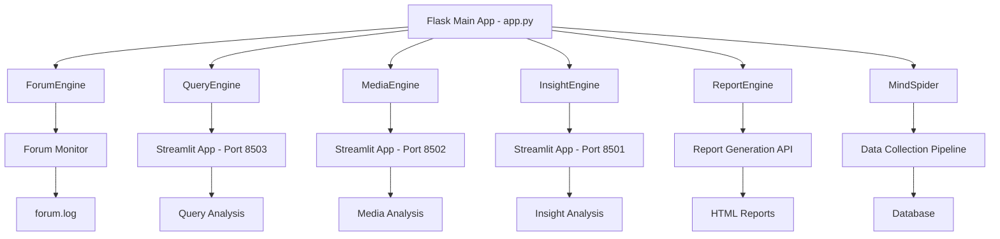
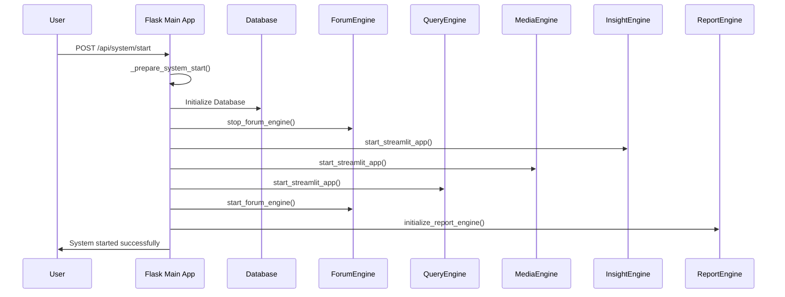
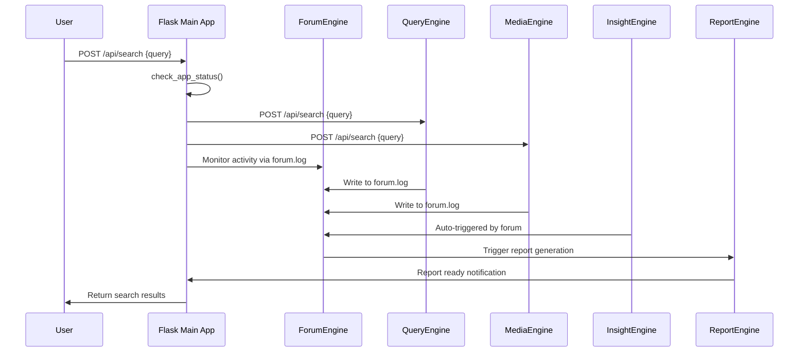
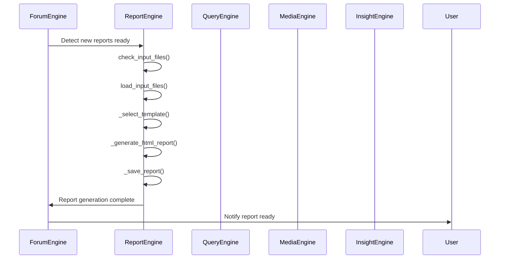
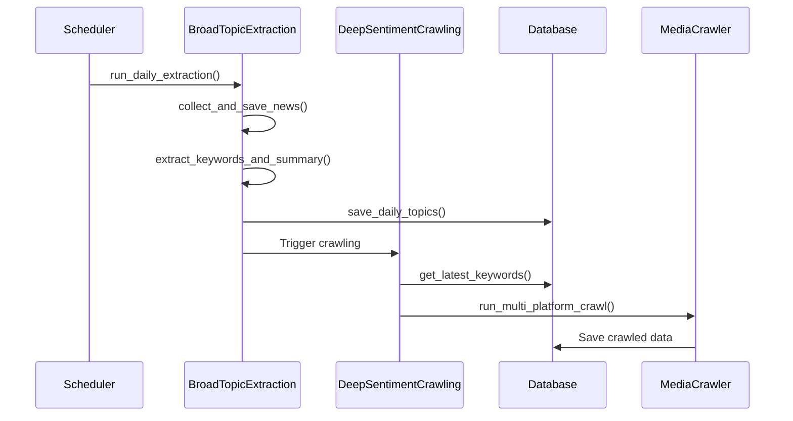

# Luồng hoạt động của Hệ thống BettaFish

## 1. Tổng quan

BettaFish là một hệ thống phân tích舆情 dư luận xã hội phức tạp, tích hợp nhiều engine chuyên biệt để thu thập, phân tích và tổng hợp dữ liệu từ nhiều nguồn khác nhau. Hệ thống được thiết kế theo kiến trúc microservices với cơ chế điều phối thông minh thông qua ForumEngine và ReportEngine.

## 2. Kiến trúc Hệ thống

### 2.1. Các Thành phần Chính



### 2.2. Cổng Giao tiếp (Ports)

| Thành phần | Port | Ghi chú |
|------------|------|---------|
| Flask Main App | 5000 | Cổng chính, điều phối toàn hệ thống |
| QueryEngine Streamlit | 8503 | API nội bộ: 8603 |
| MediaEngine Streamlit | 8502 | API nội bộ: 8602 |
| InsightEngine Streamlit | 8501 | API nội bộ: 8601 |
| ReportEngine API | /api/report/* | Tích hợp qua Flask Blueprint |

## 3. Luồng Khởi động Hệ thống

### 3.1. Initialization Sequence

```python
# 1. Khởi tạo Flask App
app = Flask(__name__)
socketio = SocketIO(app, cors_allowed_origins="*")

# 2. Đăng ký ReportEngine Blueprint
if REPORT_ENGINE_AVAILABLE:
    app.register_blueprint(report_bp, url_prefix='/api/report')

# 3. Khởi tạo system state
system_state = {
    'started': False,
    'starting': False
}

# 4. Khởi tạo processes tracking
processes = {
    'insight': {'process': None, 'port': 8501, 'status': 'stopped'},
    'media': {'process': None, 'port': 8502, 'status': 'stopped'},
    'query': {'process': None, 'port': 8503, 'status': 'stopped'},
    'forum': {'process': None, 'port': None, 'status': 'stopped'}
}
```

### 3.2. System Startup Workflow



### 3.3. Chi tiết Startup Process

#### Bước 1: Database Initialization

```python
def initialize_system_components():
    """启动所有依赖组件"""
    logs = []
    errors = []
    
    # Khởi tạo MindSpider database
    spider = MindSpider()
    if spider.initialize_database():
        logger.info("数据库初始化成功")
    else:
        logger.error("数据库初始化失败")
```

#### Bước 2: Streamlit Apps Startup

```python
for app_name, script_path in STREAMLIT_SCRIPTS.items():
    logs.append(f"检查文件: {script_path}")
    if os.path.exists(script_path):
        success, message = start_streamlit_app(app_name, script_path, processes[app_name]['port'])
        if success:
            startup_success, startup_message = wait_for_app_startup(app_name, 30)
            if not startup_success:
                errors.append(f"{app_name} 启动失败: {startup_message}")
```

#### Bước 3: ForumEngine Initialization

```python
def start_forum_engine():
    """启动ForumEngine论坛"""
    try:
        from ForumEngine.monitor import start_forum_monitoring
        logger.info("ForumEngine: 启动论坛...")
        success = start_forum_monitoring()
        return success
    except Exception as e:
        logger.exception(f"ForumEngine: 启动论坛失败: {e}")
```

## 4. Luồng Xử lý Query

### 4.1. Query Processing Flow



### 4.2. Chi tiết Query Processing

#### Bước 1: Request Reception

```python
@app.route('/api/search', methods=['POST'])
def search():
    """统一搜索接口"""
    data = request.get_json()
    query = data.get('query', '').strip()
    
    if not query:
        return jsonify({'success': False, 'message': '搜索查询不能为空'})
    
    # Kiểm tra các ứng dụng đang chạy
    check_app_status()
    running_apps = [name for name, info in processes.items() if info['status'] == 'running']
```

#### Bước 2: Distributed Processing

```python
# Gửi request đến các engine đang chạy
results = {}
api_ports = {'insight': 8601, 'media': 8602, 'query': 8603}

for app_name in running_apps:
    try:
        api_port = api_ports[app_name]
        response = requests.post(
            f"http://localhost:{api_port}/api/search",
            json={'query': query},
            timeout=10
        )
        if response.status_code == 200:
            results[app_name] = response.json()
    except Exception as e:
        results[app_name] = {'success': False, 'message': str(e)}
```

#### Bước 3: ForumEngine Monitoring

```python
def monitor_forum_log():
    """监听forum.log文件变化并推送到前端"""
    forum_log_file = LOG_DIR / "forum.log"
    last_position = 0
    
    while True:
        try:
            if forum_log_file.exists():
                with open(forum_log_file, 'r', encoding='utf-8', errors='ignore') as f:
                    f.seek(last_position)
                    new_lines = f.readlines()
                    
                    for line in new_lines:
                        parsed_message = parse_forum_log_line(line)
                        if parsed_message:
                            socketio.emit('forum_message', parsed_message)
                    
                    last_position = f.tell()
            time.sleep(1)
        except Exception as e:
            logger.error(f"Forum日志监听错误: {e}")
```

## 5. Luồng Tạo Báo cáo

### 5.1. Report Generation Workflow



### 5.2. Chi tiết Report Generation

#### Bước 1: Input File Checking

```python
def check_input_files(self, insight_dir, media_dir, query_dir, forum_log_path):
    """检查输入文件是否准备就绪"""
    directories = {
        'insight': insight_dir,
        'media': media_dir,
        'query': query_dir
    }
    
    check_result = self.file_baseline.check_new_files(directories)
    forum_ready = os.path.exists(forum_log_path)
    
    return {
        'ready': check_result['ready'] and forum_ready,
        'latest_files': self.file_baseline.get_latest_files(directories)
    }
```

#### Bước 2: Template Selection

```python
def _select_template(self, query, reports, forum_logs, custom_template):
    """选择报告模板"""
    if custom_template:
        return {
            'template_name': 'custom',
            'template_content': custom_template,
            'selection_reason': '用户指定的自定义模板'
        }
    
    template_result = self.template_selection_node.run({
        'query': query,
        'reports': reports,
        'forum_logs': forum_logs
    })
    
    return template_result
```

#### Bước 3: HTML Generation

```python
def _generate_html_report(self, query, reports, forum_logs, template_result):
    """生成HTML报告"""
    html_input = {
        'query': query,
        'query_engine_report': str(reports[0]) if len(reports) > 0 else "",
        'media_engine_report': str(reports[1]) if len(reports) > 1 else "",
        'insight_engine_report': str(reports[2]) if len(reports) > 2 else "",
        'forum_logs': forum_logs,
        'selected_template': template_result.get('template_content', '')
    }
    
    html_content = self.html_generation_node.run(html_input)
    return html_content
```

## 6. Luồng MindSpider Data Collection

### 6.1. MindSpider Workflow



### 6.2. Chi tiết Data Collection

#### Bước 1: Topic Extraction

```python
async def run_daily_extraction(self, news_sources=None, max_keywords=100):
    """运行每日话题提取流程"""
    # 1. 收集新闻
    news_result = await self.news_collector.collect_and_save_news(sources=news_sources)
    
    # 2. 提取关键词和生成总结
    keywords, summary = self.topic_extractor.extract_keywords_and_summary(
        news_result['news_list'], max_keywords=max_keywords
    )
    
    # 3. 保存到数据库
    save_success = self.db_manager.save_daily_topics(keywords, summary, date.today())
```

#### Bước 2: Deep Sentiment Crawling

```python
def run_daily_crawling(self, target_date=None, platforms=None, max_keywords_per_platform=50):
    """执行每日爬取任务"""
    # 1. 获取关键词摘要
    summary = self.keyword_manager.get_crawling_summary(target_date)
    
    # 2. 获取关键词
    keywords = self.keyword_manager.get_latest_keywords(target_date, max_keywords_per_platform)
    
    # 3. 执行全平台关键词爬取
    crawl_results = self.platform_crawler.run_multi_platform_crawl_by_keywords(
        keywords, platforms, login_type, max_notes_per_platform
    )
```

## 7. Quản lý Trạng thái và Monitoring

### 7.1. System State Management

```python
system_state_lock = threading.Lock()
system_state = {
    'started': False,
    'starting': False
}

def _set_system_state(*, started=None, starting=None):
    """Safely update the cached system state flags."""
    with system_state_lock:
        if started is not None:
            system_state['started'] = started
        if starting is not None:
            system_state['starting'] = starting
```

### 7.2. Process Monitoring

```python
def check_app_status():
    """检查应用状态"""
    for app_name, info in processes.items():
        if info['process'] is not None:
            if info['process'].poll() is None:
                # Kiểm tra port có thể truy cập không
                try:
                    response = requests.get(f"http://localhost:{info['port']}", timeout=2)
                    if response.status_code == 200:
                        info['status'] = 'running'
                    else:
                        info['status'] = 'starting'
                except requests.exceptions.RequestException:
                    info['status'] = 'starting'
            else:
                # Process đã kết thúc
                info['process'] = None
                info['status'] = 'stopped'
```

### 7.3. Real-time Communication

```python
@socketio.on('connect')
def handle_connect():
    """客户端连接"""
    emit('status', 'Connected to Flask server')

@socketio.on('request_status')
def handle_status_request():
    """请求状态更新"""
    check_app_status()
    emit('status_update', {
        app_name: {
            'status': info['status'],
            'port': info['port']
        }
        for app_name, info in processes.items()
    })
```

## 8. Error Handling và Recovery

### 8.1. Startup Error Handling

```python
def initialize_system_components():
    """启动所有依赖组件"""
    logs = []
    errors = []
    
    try:
        # Khởi tạo các components
        for app_name, script_path in STREAMLIT_SCRIPTS.items():
            success, message = start_streamlit_app(app_name, script_path, processes[app_name]['port'])
            if not success:
                errors.append(f"{app_name} 启动失败: {message}")
        
        # Nếu có lỗi, cleanup
        if errors:
            cleanup_processes()
            return False, logs, errors
        
        return True, logs, []
    
    except Exception as e:
        cleanup_processes()
        return False, logs, [str(e)]
```

### 8.2. Runtime Error Handling

```python
def read_process_output(process, app_name):
    """读取进程输出并处理错误"""
    while True:
        try:
            if process.poll() is not None:
                # Process kết thúc, đọc remaining output
                remaining_output = process.stdout.read()
                if remaining_output:
                    # Xử lý output cuối cùng
                break
            
            # Đọc output real-time
            output = process.stdout.readline()
            if output:
                # Gửi đến frontend qua WebSocket
                socketio.emit('console_output', {
                    'app': app_name,
                    'line': formatted_line
                })
        
        except Exception as e:
            logger.exception(f"Error reading output for {app_name}: {e}")
            break
```

## 9. Configuration Management

### 9.1. Dynamic Configuration

```python
def read_config_values():
    """Return the current configuration values"""
    try:
        from config import reload_settings, settings
        reload_settings()
        
        values = {}
        for key in CONFIG_KEYS:
            value = getattr(settings, key, None)
            values[key] = str(value) if value is not None else ''
        
        return values
    except Exception as exc:
        logger.exception(f"读取配置失败: {exc}")
        return {}
```

### 9.2. Configuration Updates

```python
def write_config_values(updates):
    """Persist configuration updates to .env file"""
    # Đọc existing .env file
    env_file_path = get_env_file_path()
    env_lines = env_file_path.read_text(encoding='utf-8').splitlines()
    
    # Update hoặc add configuration items
    for key, raw_value in updates.items():
        env_value = format_config_value(raw_value)
        
        if key in env_key_indices:
            # Update existing line
            env_lines[env_key_indices[key]] = f'{key}={env_value}'
        else:
            # Add new line
            env_lines.append(f'{key}={env_value}')
    
    # Write to .env file
    env_file_path.write_text('\n'.join(env_lines) + '\n', encoding='utf-8')
    
    # Reload configuration
    _load_config_module()
```

## 10. API Endpoints

### 10.1. System Management APIs

| Endpoint | Method | Function |
|----------|--------|----------|
| `/api/system/status` | GET | Lấy trạng thái hệ thống |
| `/api/system/start` | POST | Khởi động toàn bộ hệ thống |
| `/api/status` | GET | Lấy trạng thái tất cả ứng dụng |
| `/api/start/<app_name>` | GET | Khởi động ứng dụng cụ thể |
| `/api/stop/<app_name>` | GET | Dừng ứng dụng cụ thể |

### 10.2. Functional APIs

| Endpoint | Method | Function |
|----------|--------|----------|
| `/api/search` | POST | Thực hiện tìm kiếm phân tán |
| `/api/forum/log` | GET | Lấy log của ForumEngine |
| `/api/config` | GET/POST | Đọc/Cập nhật cấu hình |
| `/api/report/*` | Various | ReportEngine APIs |

## 11. Performance Optimization

### 11.1. Concurrent Processing

- **Multi-threading**: Mỗi engine chạy trong process riêng
- **Async Operations**: Sử dụng asyncio cho I/O operations
- **Non-blocking I/O**: Real-time log monitoring với select()

### 11.2. Resource Management

```python
def cleanup_processes():
    """清理所有进程"""
    for app_name in STREAMLIT_SCRIPTS:
        stop_streamlit_app(app_name)
    
    processes['forum']['status'] = 'stopped'
    try:
        stop_forum_engine()
    except Exception:
        logger.exception("停止ForumEngine失败")
    
    _set_system_state(started=False, starting=False)
```

### 11.3. Memory Optimization

- **Log Rotation**: Giới hạn số lượng lines trong memory
- **Process Cleanup**: Dọn dẹp resources khi không cần thiết
- **Connection Pooling**: Reuse database connections

## 12. Security Considerations

### 12.1. Access Control

- **CORS Configuration**: Restrict cross-origin requests
- **API Authentication**: Optional authentication for sensitive endpoints
- **Input Validation**: Validate all user inputs

### 12.2. Process Isolation

- **Separate Processes**: Mỗi engine chạy独立
- **Resource Limits**: Giới hạn memory và CPU usage
- **Error Containment**: Errors không ảnh hưởng đến hệ thống chính

## 13. Troubleshooting Guide

### 13.1. Common Issues

1. **Engine Startup Failures**:
   - Kiểm tra port availability
   - Verify file permissions
   - Check dependency installation

2. **Database Connection Issues**:
   - Verify database server running
   - Check connection parameters
   - Test network connectivity

3. **ForumEngine Not Responding**:
   - Check forum.log file permissions
   - Verify monitoring thread status
   - Restart ForumEngine if needed

### 13.2. Debug Commands

```bash
# Check system status
curl http://localhost:5000/api/system/status

# Start individual engine
curl http://localhost:5000/api/start/query

# View logs
tail -f logs/query.log
tail -f logs/forum.log

# Check configuration
curl http://localhost:5000/api/config
```

## 14. Kết luận

Hệ thống BettaFish thể hiện một kiến trúc microservices phức tạp nhưng được điều phối thông minh:

- **Modular Design**: Mỗi engine hoạt động độc lập nhưng phối hợp nhịp nhàng
- **Intelligent Orchestration**: ForumEngine đóng vai trò trung tâm điều phối
- **Real-time Communication**: WebSocket enables live monitoring
- **Fault Tolerance**: Robust error handling và recovery mechanisms
- **Scalable Architecture**: Dễ dàng mở rộng và bảo trì

Hệ thống này cung cấp một giải pháp toàn diện cho việc phân tích舆情 dư luận xã hội, từ thu thập dữ liệu, phân tích đa chiều đến tạo báo cáo tự động.