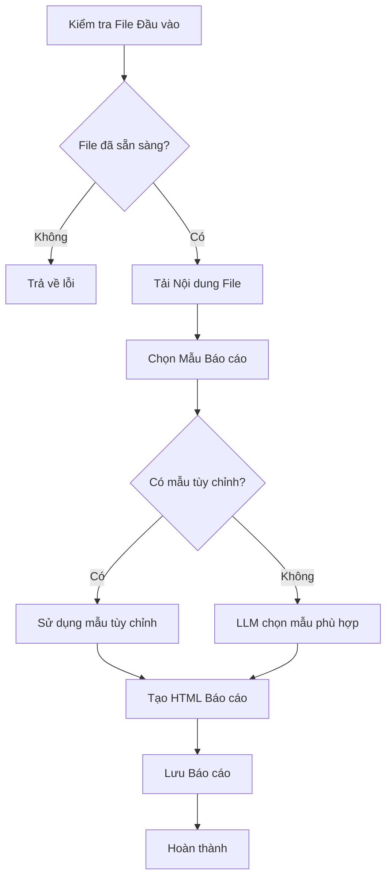
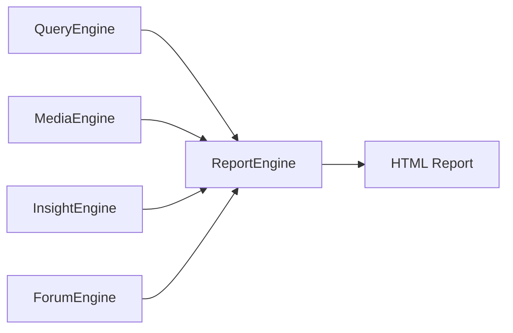

# ReportEngine Tổng quan Kiến trúc

## 1. Giới thiệu

ReportEngine là thành phần cuối cùng trong hệ thống BettaFish, chịu trách nhiệm tổng hợp và tạo báo cáo cuối cùng từ kết quả của các engine khác (QueryEngine, MediaEngine, InsightEngine) và dữ liệu giám sát từ ForumEngine. Engine này sử dụng LLM để chọn mẫu báo cáo phù hợp và tạo ra các báo cáo HTML chuyên nghiệp với dữ liệu trực quan hóa.

## 2. Mục đích Thiết kế

ReportEngine được thiết kế để:

- **Tổng hợp dữ liệu đa nguồn**: Kết hợp kết quả phân tích từ 3 engine chuyên biệt và dữ liệu giám sát từ ForumEngine
- **Tự động chọn mẫu báo cáo**: Sử dụng LLM để lựa chọn mẫu báo cáo phù hợp nhất dựa trên nội dung phân tích
- **Tạo báo cáo HTML chuyên nghiệp**: Sinh ra các báo cáo HTML hoàn chỉnh với giao diện hiện đại và dữ liệu trực quan
- **Hỗ trợ tùy chỉnh cao**: Cho phép người dùng sử dụng mẫu có sẵn hoặc mẫu tùy chỉnh
- **Quản lý workflow hiệu quả**: Cung cấp cơ chế theo dõi tiến độ và quản lý trạng thái báo cáo

## 3. Kiến trúc Chi tiết

### 3.1. Các Thành phần Chính

#### 3.1.1. ReportAgent ([`ReportEngine/agent.py`](ReportEngine/agent.py:1))

Là lớp trung tâm điều phối toàn bộ quy trình tạo báo cáo:

```python
class ReportAgent:
    def __init__(self, config: Optional[Settings] = None):
        # Khởi tạo các thành phần
        self.config = config or settings
        self.file_baseline = FileCountBaseline()  # Quản lý file baseline
        self.llm_client = self._initialize_llm()   # Khởi tạo LLM client
        self._initialize_nodes()                   # Khởi tạo các node xử lý
        self.state = ReportState()                 # Quản lý trạng thái
```

Các phương thức chính:

- [`generate_report()`](ReportEngine/agent.py:180): Tạo báo cáo hoàn chỉnh từ dữ liệu đầu vào
- [`check_input_files()`](ReportEngine/agent.py:382): Kiểm tra sự sẵn sàng của các file đầu vào
- [`load_input_files()`](ReportEngine/agent.py:443): Tải nội dung từ các file đầu vào

#### 3.1.2. FileCountBaseline ([`ReportEngine/agent.py`](ReportEngine/agent.py:21))

Quản lý việc theo dõi số lượng file để xác định khi nào có dữ liệu mới:

```python
class FileCountBaseline:
    def check_new_files(self, directories: Dict[str, str]) -> Dict[str, Any]:
        # Kiểm tra xem có file mới trong các thư mục không
        # Trả về thông tin về file mới và file còn thiếu
```

#### 3.1.3. Các Node Xử lý

**TemplateSelectionNode** ([`ReportEngine/nodes/template_selection_node.py`](ReportEngine/nodes/template_selection_node.py:15)):

```python
class TemplateSelectionNode(BaseNode):
    def run(self, input_data: Dict[str, Any], **kwargs) -> Dict[str, Any]:
        # Phân tích nội dung và chọn mẫu báo cáo phù hợp
        # Sử dụng LLM để đưa ra quyết định thông minh
```

**HTMLGenerationNode** ([`ReportEngine/nodes/html_generation_node.py`](ReportEngine/nodes/html_generation_node.py:18)):

```python
class HTMLGenerationNode(StateMutationNode):
    def run(self, input_data: Dict[str, Any], **kwargs) -> str:
        # Tạo HTML báo cáo từ nội dung đã tổng hợp
        # Tích hợp Chart.js để trực quan hóa dữ liệu
```

#### 3.1.4. Flask Interface ([`ReportEngine/flask_interface.py`](ReportEngine/flask_interface.py:1))

Cung cấp API REST để tương tác với ReportEngine:

- `/status`: Kiểm tra trạng thái của ReportEngine
- `/generate`: Bắt đầu quá trình tạo báo cáo
- `/progress/<task_id>`: Lấy tiến độ tạo báo cáo
- `/result/<task_id>`: Lấy kết quả báo cáo
- `/templates`: Lấy danh sách các mẫu có sẵn

### 3.2. Quản lý Trạng thái

#### 3.2.1. ReportState ([`ReportEngine/state/state.py`](ReportEngine/state/state.py:31))

```python
@dataclass 
class ReportState:
    # Thông tin cơ bản
    task_id: str = ""
    query: str = ""
    status: str = "pending"  # pending, processing, completed, failed
    
    # Dữ liệu đầu vào
    query_engine_report: str = ""
    media_engine_report: str = ""
    insight_engine_report: str = ""
    forum_logs: str = ""
    
    # Kết quả xử lý
    selected_template: str = ""
    html_content: str = ""
    
    # Metadata
    metadata: ReportMetadata = field(default_factory=ReportMetadata)
```

#### 3.2.2. ReportMetadata ([`ReportEngine/state/state.py`](ReportEngine/state/state.py:13))

```python
@dataclass
class ReportMetadata:
    query: str = ""
    template_used: str = ""
    generation_time: float = 0.0
    timestamp: str = field(default_factory=lambda: datetime.now().isoformat())
```

### 3.3. Hệ thống Prompt

#### 3.3.1. Template Selection Prompt ([`ReportEngine/prompts/prompts.py`](ReportEngine/prompts/prompts.py:45))

```python
SYSTEM_PROMPT_TEMPLATE_SELECTION = f"""
Bạn là một trợ lý lựa chọn mẫu báo cáo thông minh. Dựa trên nội dung truy vấn và đặc điểm báo cáo, chọn mẫu phù hợp nhất.

Các tiêu chí lựa chọn:
1. Loại chủ đề truy vấn (thương hiệu doanh nghiệp, cạnh tranh thị trường, phân tích chính sách, v.v.)
2. Mức độ khẩn cấp và tính thời sự của báo cáo
3. Yêu cầu về độ sâu và rộng của phân tích
4. Đối tượng mục tiêu và kịch bản sử dụng
"""
```

#### 3.3.2. HTML Generation Prompt ([`ReportEngine/prompts/prompts.py`](ReportEngine/prompts/prompts.py:73))

```python
SYSTEM_PROMPT_HTML_GENERATION = f"""
Bạn là chuyên gia tạo báo cáo HTML chuyên nghiệp. Bạn sẽ nhận nội dung từ ba engine phân tích, log giám sát forum và mẫu báo cáo đã chọn để tạo báo cáo HTML hoàn chỉnh.

Yêu cầu HTML:
1. Cấu trúc HTML hoàn chỉnh với DOCTYPE, html, head, body
2. CSS responsive và hiện đại
3. Tích hợp Chart.js để trực quan hóa dữ liệu
4. Không sử dụng hiệu ứng cần mở rộng, hiển thị đầy đủ nội dung
"""
```

## 4. Workflow Hoạt động

### 4.1. Quy trình Tạo Báo cáo



### 4.2. Chi tiết các bước

#### Bước 1: Kiểm tra File Đầu vào

```python
def check_input_files(self, insight_dir, media_dir, query_dir, forum_log_path):
    # Sử dụng FileCountBaseline để kiểm tra file mới
    directories = {
        'insight': insight_dir,
        'media': media_dir,
        'query': query_dir
    }
    check_result = self.file_baseline.check_new_files(directories)
    
    # Kiểm tra file log của forum
    forum_ready = os.path.exists(forum_log_path)
    
    return {
        'ready': check_result['ready'] and forum_ready,
        'latest_files': self.file_baseline.get_latest_files(directories)
    }
```

#### Bước 2: Tải Nội dung File

```python
def load_input_files(self, file_paths):
    content = {
        'reports': [],
        'forum_logs': ''
    }
    
    # Tải báo cáo từ 3 engine theo thứ tự
    engines = ['query', 'media', 'insight']
    for engine in engines:
        if engine in file_paths:
            with open(file_paths[engine], 'r', encoding='utf-8') as f:
                report_content = f.read()
            content['reports'].append(report_content)
    
    # Tải log forum
    if 'forum' in file_paths:
        with open(file_paths['forum'], 'r', encoding='utf-8') as f:
            content['forum_logs'] = f.read()
    
    return content
```

#### Bước 3: Chọn Mẫu Báo cáo

```python
def _select_template(self, query, reports, forum_logs, custom_template):
    # Ưu tiên mẫu tùy chỉnh của người dùng
    if custom_template:
        return {
            'template_name': 'custom',
            'template_content': custom_template,
            'selection_reason': 'Người dùng chỉ định mẫu tùy chỉnh'
        }
    
    # Sử dụng LLM để chọn mẫu phù hợp
    template_input = {
        'query': query,
        'reports': reports,
        'forum_logs': forum_logs
    }
    
    template_result = self.template_selection_node.run(template_input)
    return template_result
```

#### Bước 4: Tạo HTML Báo cáo

```python
def _generate_html_report(self, query, reports, forum_logs, template_result):
    # Chuẩn bị dữ liệu đầu vào
    html_input = {
        'query': query,
        'query_engine_report': str(reports[0]) if len(reports) > 0 else "",
        'media_engine_report': str(reports[1]) if len(reports) > 1 else "",
        'insight_engine_report': str(reports[2]) if len(reports) > 2 else "",
        'forum_logs': forum_logs,
        'selected_template': template_result.get('template_content', '')
    }
    
    # Tạo HTML sử dụng HTMLGenerationNode
    html_content = self.html_generation_node.run(html_input)
    
    # Cập nhật trạng thái
    self.state.html_content = html_content
    self.state.mark_completed()
    
    return html_content
```

## 5. Tính năng Nâng cao

### 5.1. Quản lý Task Bất đồng bộ

ReportEngine hỗ trợ xử lý nhiều báo cáo đồng thời thông qua cơ chế task:

```python
class ReportTask:
    def __init__(self, query: str, task_id: str, custom_template: str = ""):
        self.task_id = task_id
        self.query = query
        self.custom_template = custom_template
        self.status = "pending"  # pending, running, completed, error
        self.progress = 0
        self.html_content = ""
```

### 5.2. API Endpoint Đa dạng

Flask interface cung cấp các endpoint đầy đủ:

```python
@report_bp.route('/generate', methods=['POST'])
def generate_report():
    # Bắt đầu tạo báo cáo mới

@report_bp.route('/progress/<task_id>', methods=['GET'])
def get_progress(task_id):
    # Lấy tiến độ tạo báo cáo

@report_bp.route('/result/<task_id>', methods=['GET'])
def get_result(task_id):
    # Lấy kết quả báo cáo HTML

@report_bp.route('/templates', methods=['GET'])
def get_templates():
    # Lấy danh sách mẫu có sẵn
```

### 5.3. Xử lý Lỗi và Fallback

ReportEngine có cơ chế xử lý lỗi robust:

```python
def _generate_fallback_html(self, input_data):
    # Tạo HTML đơn giản khi LLM thất bại
    # Đảm bảo luôn có kết quả đầu ra
```

## 6. Cấu hình và Tùy chỉnh

### 6.1. Cấu hình LLM

```python
def _initialize_llm(self) -> LLMClient:
    return LLMClient(
        api_key=self.config.REPORT_ENGINE_API_KEY,
        model_name=self.config.REPORT_ENGINE_MODEL_NAME,
        base_url=self.config.REPORT_ENGINE_BASE_URL,
    )
```

### 6.2. Cấu hình Template

ReportEngine hỗ trợ 6 loại template mặc định:

1. **企业品牌声誉分析报告模板**: Phân tích thương hiệu và danh tiếng doanh nghiệp
2. **市场竞争格局舆情分析报告模板**: Phân tích cạnh tranh thị trường
3. **日常或定期舆情监测报告模板**: Báo cáo giám sát định kỳ
4. **特定政策或行业动态舆情分析报告**: Phân tích chính sách và ngành
5. **社会公共热点事件分析报告模板**: Phân tích sự kiện công cộng
6. **突发事件与危机公关舆情报告模板**: Báo cáo khủng hoảng

## 7. Tối ưu hóa Hiệu suất

### 7.1. Quản lý File Baseline

```python
class FileCountBaseline:
    def __init__(self):
        self.baseline_file = 'logs/report_baseline.json'
        self.baseline_data = self._load_baseline()
    
    def check_new_files(self, directories):
        # Chỉ xử lý khi có file mới
        # Tránh xử lý lại dữ liệu cũ
```

### 7.2. Caching và State Management

- Sử dụng ReportState để theo dõi tiến độ
- Lưu trạng thái vào file để khôi phục khi cần
- Quản lý task hiệu quả với threading

## 8. Tích hợp Hệ thống

### 8.1. Tích hợp với các Engine khác

ReportEngine là điểm cuối của pipeline:



### 8.2. Tích hợp với Main Application

```python
# Trong app.py
from ReportEngine.flask_interface import report_bp

app.register_blueprint(report_bp, url_prefix='/report')
```

## 9. Gỡ lỗi và Khắc phục sự cố

### 9.1. Logging Chi tiết

ReportEngine sử dụng loguru để ghi log chi tiết:

```python
logger.info(f"Bắt đầu tạo báo cáo: {query}")
logger.info(f"Đầu vào - Số báo cáo: {len(reports)}, Độ dài log forum: {len(forum_logs)}")
logger.info(f"Chọn mẫu: {template_result['template_name']}")
```

### 9.2. Common Issues và Solutions

1. **LLM không trả về JSON hợp lệ**:
   - Sử dụng `_clean_llm_response()` để làm sạch response
   - Fallback về template mặc định

2. **File đầu vào chưa sẵn sàng**:
   - Sử dụng FileCountBaseline để theo dõi
   - API trả về thông tin chi tiết về file còn thiếu

3. **Quá trình tạo báo cáo quá lâu**:
   - Sử dụng threading để xử lý bất đồng bộ
   - Cung cấp endpoint progress để theo dõi

## 10. Kết luận

ReportEngine là thành phần quan trọng hoàn thiện hệ thống BettaFish, với khả năng:

- **Tổng hợp thông minh**: Tự động tích hợp dữ liệu từ nhiều nguồn
- **Lựa chọn mẫu thông minh**: Sử dụng LLM để chọn mẫu phù hợp nhất
- **Tạo báo cáo chuyên nghiệp**: Sinh ra HTML hiện đại với trực quan hóa dữ liệu
- **Quản lý workflow hiệu quả**: Hỗ trợ theo dõi tiến độ và xử lý bất đồng bộ
- **Khả năng tùy chỉnh cao**: Hỗ trợ cả mẫu có sẵn và mẫu tùy chỉnh

Với kiến trúc module hóa và khả năng xử lý mạnh mẽ, ReportEngine cung cấp giải pháp hoàn chỉnh cho việc tạo báo cáo tự động từ dữ liệu phân tích đa nguồn.