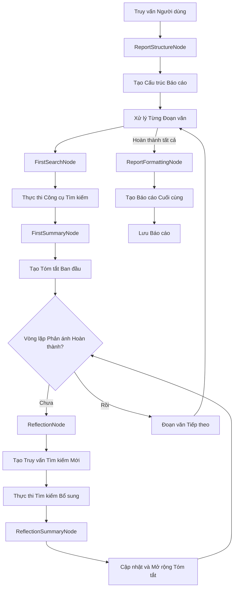

# Tổng quan Kiến trúc BettaFish

## Giới thiệu

BettaFish là một nền tảng phân tích舆情 dư luận xã hội đa động cơ, được thiết kế để thu thập, phân tích và tổng hợp thông tin từ nhiều nguồn khác nhau. Hệ thống sử dụng các AI Agent chuyên biệt để thực hiện nghiên cứu sâu và tạo ra các báo cáo toàn diện.

## Kiến trúc Tổng thể

### Các Thành phần Chính

```
BettaFish/
├── ForumEngine/          # Động cơ giám sát và điều phối
├── InsightEngine/        # Động cơ nghiên cứu sâu (cơ sở dữ liệu địa phương)
├── MediaEngine/          # Động cơ tìm kiếm đa phương tiện
├── QueryEngine/          # Động cơ tìm kiếm tin tức
├── ReportEngine/         # Động cơ tạo báo cáo
├── MindSpider/           # Hệ thống thu thập dữ liệu
├── SentimentAnalysisModel/ # Mô hình phân tích cảm xúc
├── SingleEngineApp/      # Giao diện Streamlit cho từng động cơ
└── app.py               # Ứng dụng Flask chính điều phối hệ thống
```

## Chi tiết các Động cơ

### 1. InsightEngine
- **Mục đích**: Nghiên cứu sâu dựa trên cơ sở dữ liệu địa phương
- **Công cụ chính**: MediaCrawlerDB
- **Tính năng**:
  - 6 công cụ tìm kiếm cơ sở dữ liệu chuyên dụng
  - Phân tích cảm xúc đa ngôn ngữ (22 ngôn ngữ)
  - Tối ưu hóa từ khóa tìm kiếm
- **Đầu ra**: Báo cáo phân tích dư luận chi tiết

### 2. MediaEngine
- **Mục đích**: Tìm kiếm và phân tích nội dung đa phương tiện
- **Công cụ chính**: BochaMultimodalSearch
- **Tính năng**:
  - 5 công cụ tìm kiếm đa phương tiện
  - Hỗ trợ tìm kiếm web toàn diện
  - Phân tích nội dung đa định dạng
- **Đầu ra**: Báo cáo phân tích nội dung media

### 3. QueryEngine
- **Mục đích**: Tìm kiếm và phân tích tin tức
- **Công cụ chính**: TavilyNewsAgency
- **Tính năng**:
  - 6 công cụ tìm kiếm tin tức chuyên dụng
  - Hỗ trợ tìm kiếm theo thời gian
  - Tìm kiếm hình ảnh liên quan
- **Đầu ra**: Báo cáo phân tích tin tức

### 4. ReportEngine
- **Mục đích**: Tổng hợp và tạo báo cáo cuối cùng
- **Tính năng**:
  - Lựa chọn mẫu báo cáo tự động
  - Tạo báo cáo HTML từ nhiều nguồn
  - Quản lý phiên bản báo cáo
- **Đầu ra**: Báo cáo HTML chuyên nghiệp

### 5. ForumEngine
- **Mục đích**: Giám sát và điều phối các động cơ khác
- **Tính năng**:
  - Giám sát log thời gian thực
  - Điều phối giao tiếp giữa các động cơ
  - Tạo "diễn đàn" ảo cho các AI Agent
- **Đầu ra**: Log điều phối và thông tin hệ thống

## Luồng hoạt động của Hệ thống

### 1. Khởi tạo Hệ thống
```python
# app.py khởi tạo tất cả các thành phần
system = Flask(__name__)
socketio = SocketIO(system)

# Khởi tạo các động cơ Streamlit
start_streamlit_app('insight', 'SingleEngineApp/insight_engine_streamlit_app.py', 8501)
start_streamlit_app('media', 'SingleEngineApp/media_engine_streamlit_app.py', 8502)
start_streamlit_app('query', 'SingleEngineApp/query_engine_streamlit_app.py', 8503)

# Khởi tạo ForumEngine
start_forum_engine()
```

### 2. Quy trình Nghiên cứu

#### Bước 1: Tạo Cấu trúc Báo cáo
- **Node**: ReportStructureNode
- **Mục đích**: Phân tích truy vấn người dùng và tạo dàn ý báo cáo
- **Đầu ra**: 5-7 đoạn văn với tiêu đề và nội dung dự kiến

#### Bước 2: Xử lý Từng Đoạn văn
Đối với mỗi đoạn văn trong cấu trúc:

**A. Tìm kiếm và Tóm tắt Ban đầu**
- **SearchNode**: FirstSearchNode
  - Tạo truy vấn tìm kiếm dựa trên tiêu đề đoạn văn
  - Chọn công cụ tìm kiếm phù hợp
  - Thực thi tìm kiếm và thu thập dữ liệu

- **SummaryNode**: FirstSummaryNode
  - Xử lý kết quả tìm kiếm
  - Tạo nội dung đoạn văn ban đầu (800-1200 từ)
  - Tích hợp phân tích cảm xúc

**B. Vòng lặp Phản ánh** (Lặp theo cấu hình)
- **ReflectionNode**: ReflectionNode
  - Phân tích nội dung hiện tại
  - Xác định khoảng trống thông tin
  - Tạo truy vấn tìm kiếm mới

- **ReflectionSummaryNode**: ReflectionSummaryNode
  - Tích hợp kết quả tìm kiếm mới
  - Cập nhật và mở rộng nội dung
  - Đạt 1000-1500 từ với phân tích sâu hơn

#### Bước 3: Tạo Báo cáo Cuối cùng
- **Node**: ReportFormattingNode
- **Mục đích**: Kết hợp tất cả đoạn văn thành báo cáo nhất quán
- **Đầu ra**: Báo cáo markdown định dạng chuyên nghiệp

#### Bước 4: Lưu Báo cáo
- Lưu báo cáo cuối cùng vào file
- Tùy chọn lưu trạng thái trung gian để tiếp tục sau

### 3. Điều phối và Giám sát

ForumEngine giám sát tất cả các hoạt động:
- Theo dõi log của ba động cơ chính
- Bắt đầu phiên "diễn đàn" khi phát hiện hoạt động tìm kiếm
- Tạo điều phối viên (host) để tổng hợp và điều phối
- Kết thúc phiên khi không có hoạt động mới

## Kiến trúc DeepSearchAgent

### Các Thành phần Cốt lõi

1. **Quản lý Trạng thái (State Management)**
   - Theo dõi toàn bộ quá trình nghiên cứu
   - Lưu trữ lịch sử tìm kiếm và kết quả
   - Quản lý tiến độ hoàn thành

2. **Các Node Xử lý (Processing Nodes)**
   - Mỗi node xử lý một giai đoạn cụ thể
   - Kế thừa từ BaseNode hoặc StateMutationNode
   - Thực hiện xác thực, xử lý và cập nhật trạng thái

3. **Tích hợp Công cụ (Tool Integration)**
   - Kết nối với các nguồn dữ liệu bên ngoài
   - Thực hiện tìm kiếm và phân tích
   - Trả về kết quả có cấu trúc

4. **Tích hợp LLM (LLM Integration)**
   - Cung cấp khả năng suy luận
   - Sinh nội dung tự nhiên
   - Phân tích và tổng hợp thông tin

### Sơ đồ Luồng Dữ liệu



## Tính năng Nâng cao

### 1. Tối ưu hóa Từ khóa
- Tự động tinh chỉnh truy vấn tìm kiếm
- Sử dụng xử lý ngôn ngữ tự nhiên
- Tránh thuật ngữ chính thức, ưu tiên ngôn ngữ người dùng

### 2. Phân tích Cảm xúc
- Tích hợp phân tích cảm xúc trên kết quả tìm kiếm
- Hỗ trợ đa ngôn ngữ
- Chấm điểm độ tin cậy cho phân loại cảm xúc

### 3. Xử lý Lỗi và Phục hồi
- Phân tích JSON với sửa chữa tự động
- Cơ chế dự phòng cho các hoạt động thất bại
- Suy thoái gracful khi công cụ không khả dụng

### 4. Tích hợp Diễn đàn
- ForumEngine giám sát đầu ra của tất cả động cơ
- Tạo điều phối giao tiếp liên động cơ
- Cung cấp "thảo luận" được điều phối giữa các AI Agent

## Cấu hình và Tùy chỉnh

Hệ thống có thể cấu hình cao thông qua:
- **Cài đặt**: Khóa API, tên mô hình, giới hạn tìm kiếm
- **Số lần Phản ánh**: Số lần lặp tinh chỉnh
- **Thư mục Đầu ra**: Nơi lưu báo cáo
- **Lựa chọn Công cụ**: Công cụ tìm kiếm sử dụng

## Giao diện Người dùng

### 1. Giao diện Flask Chính
- Địa chỉ: http://localhost:5000
- Điều phối tất cả các động cơ
- Cung cấp trạng thái hệ thống thời gian thực

### 2. Giao diện Streamlit riêng
- InsightEngine: http://localhost:8501
- MediaEngine: http://localhost:8502
- QueryEngine: http://localhost:8503

### 3. API Endpoints
- `/api/status` - Trạng thái hệ thống
- `/api/search` - Tìm kiếm thống nhất
- `/api/system/start` - Khởi động hệ thống
- `/api/report/*` - API ReportEngine

## Kết luận

Kiến trúc BettaFish được thiết kế để cung cấp phân tích dư luận xã hội toàn diện và sâu sắc thông qua:
- Nhiều động cơ chuyên biệt hoạt động song song
- Quy trình nghiên cứu lặp tự động
- Khả năng tích hợp nhiều nguồn dữ liệu
- Giao tiếp điều phối thông minh giữa các thành phần

Kiến trúc này cho phép hệ thống tạo ra các báo cáo chất lượng cao kết hợp nhiều nguồn dữ liệu, tinh chỉnh lặp và sinh nội dung thông minh.